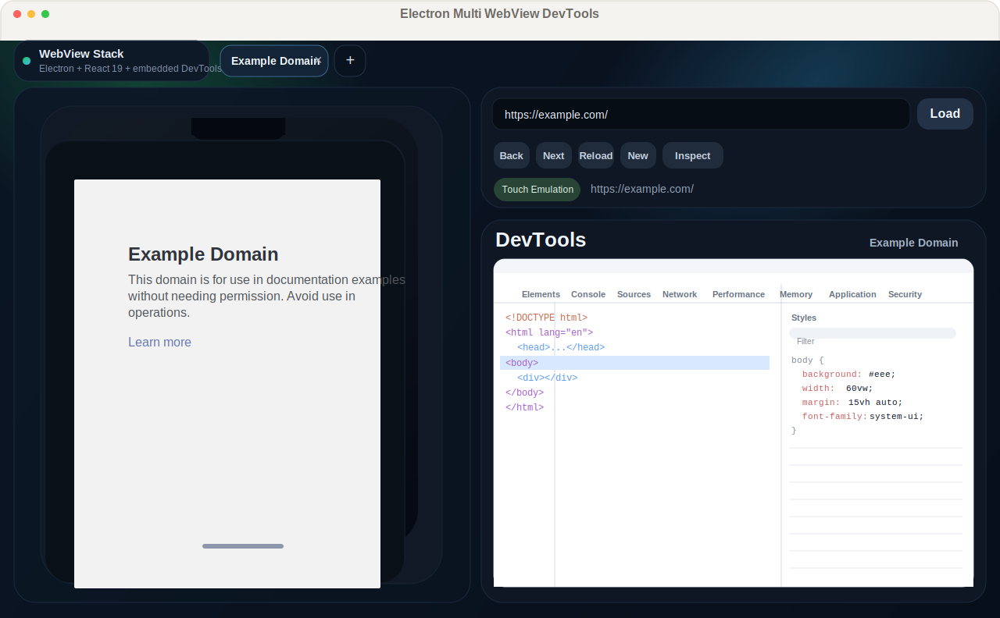

# Electron Multi WebView DevTools

[简体中文](./README.zh-CN.md)

[](https://www.electronjs.org/)
[](https://react.dev/)
[](https://www.typescriptlang.org/)
[](#overview)
[](./LICENSE)

An Electron-based technical template for projects that need multi-webview debugging capabilities.

## Overview

`electron-multi-webview-devtools` is a lightweight reference project built with Electron, React 19, TypeScript, and `electron-vite`.

It is intended as a technical template for teams that need to build multi-webview debugging experiences into their own Electron applications.

Instead of positioning itself as a finished end-user debugging product, this repository demonstrates how to organize multiple `WebContentsView` instances, attach DevTools to the active session, emulate mobile behavior, and keep inspect mode synchronized across hosted content and embedded DevTools.

## Features

- Reference architecture for multi-webview debugging in Electron
- Multiple isolated webview sessions managed as tabs
- Mobile-style viewport rendering with touch emulation enabled by default
- Embedded DevTools panel for the active session
- Inspect mode sync between DevTools and the hosted page
- Stacked session preview for recently opened webviews
- Basic navigation controls: back, forward, reload, open URL, create, close
- `window.open()` interception that opens new pages as new internal sessions
- External protocol fallback for non-HTTP(S) links

## Use Cases

- Building internal debugging tools for apps that host multiple web runtimes
- Prototyping embedded DevTools workflows before integrating into a larger Electron product
- Reusing the session/view management approach as a starting point for custom debugging platforms

## Non-Goals

- A polished standalone browser replacement
- A fully packaged debugging product for end users
- Full-fidelity device simulation

## Tech Stack

- Electron 41
- React 19
- TypeScript 5
- Vite via `electron-vite`

## Project Structure

```text
.
├── src/main            # Electron main process, session/view management
├── src/preload         # Secure IPC bridge exposed to the renderer
├── src/renderer        # React UI for tabs, controls, and layout containers
├── src/shared          # Shared TypeScript types
├── electron.vite.config.ts
└── package.json
```

Architecture notes:
- [Main process architecture](./docs/main-process-architecture.md)

## Screenshot



## Quick Start

### Requirements

- Node.js 18+
- npm

### Install

```bash
npm install
```

### Run in Development

```bash
npm run dev
```

### Type Check

```bash
npm run typecheck
```

### Build

```bash
npm run build
```

### Preview Built App

```bash
npm run preview
```

## How It Works

1. The renderer draws the application shell and reports the mobile/devtools viewport bounds to the main process.
2. The main process creates one `WebContentsView` for page content and one `WebContentsView` for DevTools per session.
3. The active session is attached to the main window together with its DevTools view.
4. Chrome DevTools Protocol is used to enable:
   - mobile metrics override
   - touch emulation
   - inspect-element overlay
5. A small bridge script is injected into the DevTools frontend so inspect mode stays aligned with the hosted page input mode.

## What This Template Demonstrates

- The initial page defaults to `https://example.com`
- URLs entered without protocol are normalized to `https://...`
- Closing the last session automatically creates a new default session
- Only the active session shows DevTools; background sessions remain visible as stacked previews

## Limitations

- No packaged installer is included yet
- No automated tests are included yet
- The repository is intentionally kept small and focused on the core multi-webview pattern
- The app does not aim to fully emulate real devices

## Scripts

```bash
npm run dev
npm run build
npm run preview
npm run typecheck
```

## Roadmap

- Add session persistence
- Add configurable device presets
- Add address history and bookmark support
- Add packaging and release workflow
- Add automated tests

## Open Source Notes

- If you add CI or packaging later, then add corresponding badges instead of placeholder-free badges

## Contributing

Issues and pull requests are welcome. If you plan to extend the debugging workflow, please keep the main-process view management and DevTools synchronization behavior explicit and easy to reason about.

## License

This repository is licensed under the MIT License. See [LICENSE](./LICENSE).
